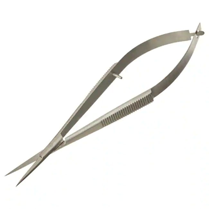
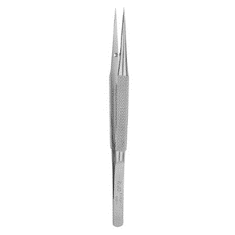
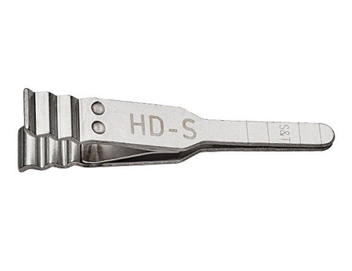
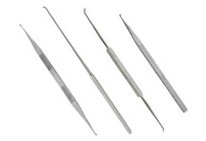
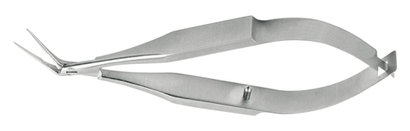
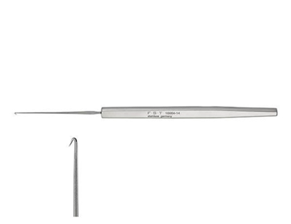
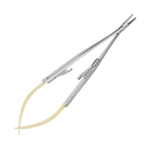

Neurosurgery is the most demanding and highly complicated field of medicine. It deals with the diagnosis of complications related to the central nervous system. It demands a sense of empathy and dexterity for a successful operation. Formerly, neurosurgeons performed procedures on a macro level, but the need for bleeding and tissue damage control led to the evolution of micro procedures, typically known as micro-neurosurgery or microsurgery for the brain.

Microsurgery is a new term; it means surgery performed on body structures on a micro level, usually with the help of a magnifier. It has contributed mostly to the procedures done on the eye and brain. Being a distinctive domain, the instruments used for it are also distinct, known as micro instruments. In this blog, we will discuss the basic mechanics of some of these **[neurology tools](https://www.dynamicmedicalsolution.com/products/blades-scalpels)**:

  

    - **Scissors:** They have finger ring holders with a lock mechanism for microvascular work. It may be straight or slightly angled. Due to their sensitive nature, they are usually in a metal case holder.
  

  

    
  

  

    - **Forceps:** Long and fine bayonet forceps are used for microsurgical procedures and only under a microscope. Their tips are straight, sharp, and pointed. They are usually performed on structures less than 3 mm in width. A special kind of forceps known as hunt forceps is also used for this purpose. They have a special design with a toothed, circular tip for holding pathological tissue.
  

  

    
  

- **Clamps:**

  

    1. **Bulldog clamps:** The most common clamps in the field of neurosurgery are Bulldog clamps, which can be:
    
    - _Artery clamp:_ It is usually 15 cm long and designed so as not to damage the tissues.
    - _Carotid clamp:_ The handle is shaped like a bow, and the mouthpiece is at a right angle. It is used for internal and external carotid arteries.
  

  

    
  

  

    2. **Jacobson’s clamp:** It is pen-like with pot’s teeth and specially designed for internal carotid.
  

  

    
  

  

    3. **Scoville clamp:** A very small instrument with a small, rounded head. It takes up very little space in the operating room. It may be straight or angled.
  

  

    
  

  

    4. **Micro clamps:** They are used for vessels of 0.8 to 1.5 mm in diameter.
    
    - **Curettes and dissectors:** Curettes are very slender with sharp and pointed end pieces. Dissectors with double and different ends are also available, one with an oval shape and the other with a pointed shape.
    
    - **Forceps and punches:** They are 18 cm in length and are used for holding and resecting tissues. The mouthpiece may be round, oval, or fluted.
    
    - **Scalpels:** Scalpels consist of long, thin pieces of razor blades. They are the most suitable instruments for microincisions.
    
    - **Hooks:** Hooks are made from injection needles with their tip bent over, and their size and sharpness can be changed at will.
    
    - **Needle holder:** They are very long with spring grips and maybe with or without locks. They are used for the treatment of vessels with a diameter of less than 3 mm.
  

  

    
  

  

    
  

## Conclusion

**[Neurology surgical instruments](https://www.dynamicmedicalsolution.com/categories/neurological-spine-instruments)** have continued to benefit the field of neurosurgery through a variety of technological advances. They are highly fragile and difficult to handle. Meticulousness is required for their maintenance. Please visit our website Dynamic for more information.
