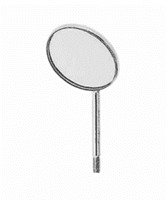
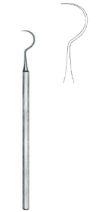
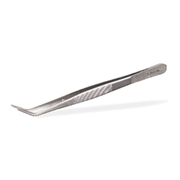
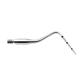

Oral health is of utmost importance for the prevention of many microbial infections. It is because the oral cavity is the primary entrance to many kinds of germs, microorganisms, and other substances. And if this primary source is kept hygienic, the chances of getting sick are reduced. For this purpose, biomedical engineers have developed several dental hygiene instruments.

A dental hygiene instrument is a non-surgical **[dental instrument](https://www.dynamicmedicalsolution.com/categories/dental-instruments)** used for dental and oral care. It is used by both professionals and the general public for everyday use. It is user-friendly, environment-friendly, and cheap.

Here in this blog, we will discuss five common dental hygienic instruments with their functions, designs, and types:

## 1. Dental mouth mirror

**Design:** It consists of a handle, a shaft, and a working end comprised of a mirror. The handle and mirror can be of various types.

**Functions:**

  

    - It provides a clear indirect vision of those parts that cannot be seen by
    the naked eye. - It is also used for the retraction of the cheeks, tongue,
    and lips. - It also provides light inside the mouth through reflection.
  

  

    
  

**Types of mirrors:**

1. Front-surface mirrors: They provide a clear and accurate image without distortion.
2. Double-sided mirrors are used for the examination of the intraoral cavity and retraction of the cheek and tongue.
3. Flat mirrors: They are used for disposable types of mirrors.
4. Concave mirrors are used to magnify images.
5. Size: It is available in a range of sizes, such as sizes #1, #2, #3, and #4. These sizes refer to the diameter of the mirror.

**Sterilization:** It must be precleaned and sterilized before packaging. They are used by dentists with a tray setup.

## 2. Dental Explorers

**Function:**

  

    It is used for the examination of tooth decay known as caries or cavities,
    furcation, calculus, and other complications.
  

  

    
  

**Design:** It is very sharp, thin, and flexible. Its tips are pointed, and the working end may be single- or double-ended. For the double-ended explorer, it may have an explorer on one end and a probe on the other end.

**Types:**

1. Orban explorer
2. Pigtail explorer
3. Sheperd’s Hook Explorer

**Sterilization:** It must be precleaned, then wrapped, and then sterilized after wrapping. An internal process indicator must be wrapped within it. Surgeons use it with tray setups.

## 3. Dental Tweezers

**Function:**

  

    It is used for removing debris, handling small objects, and for oral
    examination.
  

  

    
  

**Design:** Most of them are made up of stainless steel, and some are made from titanium, which is lighter in weight and more resistant to corrosion. The tips are designed differently; they may be straight, curved, angled, serrated, or non-serrated. They are 10 to 20 cm in length.

**Types:**

- College tweezers
- Cotton tweezers
- Hemostatic tweezers
- Utility tweezers

**Sterilization:** They are very easy to clean and sterilize. They are always sterilized before and after packing.

## 4. Dental probe

**Design:** Most are made of stainless steel, and some have a plastic coating to reduce glare. They are long with different kinds of tips, such as straight, curved, and pointed.

**Function:**

  

    It is used for the evaluation of gum health by assessing its depth, caries,
    or any kind of plaque. It is also used for the diagnosis of tooth diseases.
  

  

    
  

**Sterilization:** They are thoroughly cleaned and sterilized during the manufacturing process and then packaged. After packaging, they are again sterilized and ready for use.

**Types:**

- Color-coded: They have color bands at regular intervals for clear calibration.
- Non-color coded: They have markings on them etched or engraved that require close inspection.

## 5. Dental toothpick

**Function:**

  

    They are small **[dental
    instruments](https://www.dynamicmedicalsolution.com/products/dental-instruments)**
    that are used to remove food particles and plaques in between or along the
    gumline. Although they are very tiny, they also come in various designs,
    including:
  

  

    
  

**Material:**

- Wood: Conventional toothpicks that are used in homes are made of wood. They are biodegradable.
- Plastic: Nowadays, they are made of plastic and are highly flexible.
- Bamboo: They are also used in some countries and are known for their eco-friendly nature.

**Shape:** Based on shape, they may be pointed, flat, triangular, or double-ended.

**Texture:** Based on texture, they may be smooth for gentle cleansing, grooved for a strong grip, or flavored to freshen.

## Conclusion

Dental hygiene instruments are different from **[surgical instruments dental](https://www.dynamicmedicalsolution.com/products/dental-instruments)**. They are specially designed for healthcare and disease prevention. They are different from dental surgical instruments in terms of size, price, and design. They are made for use at both homes and clinics. They are available on the market with different quality and prices.

Please visit our website, Dynamic, for more information.
