**[Surgical forceps](https://www.dynamicmedicalsolution.com/categories/general-instrumentation)**
are medical instruments with a historic legacy. They are derived from two words formus and caper;
formus means hot and caper means to hold. Men have used them for different purposes. Formerly, they
were made of bronze and iron, but with the advancement of science and technology, a tremendous
change in their shape, design, and material has occurred. Now they are highly specialized, and most are
made of stainless steel.
In this blog, we will discuss 12 important **[types of surgical forceps](https://www.dynamicmedicalsolution.com/products/forceps)** and their functions:

## Endodontic Forceps

  

    - Endodontic Forceps are also known as Mixter Forceps. They fall into the category of cutting and dissecting instruments. The tip may be curved at 90 degrees. They have cross-hatch serrations that run along the length of the inner jaws. They are used for the dissection of tubular structures.
  

  

    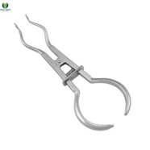
  

## Biopsy Forceps

  

    - Biopsy Forceps fall into the category of cutting and dissecting tools. They are very sharp and oval-shaped. They are used to dissect small tissue pieces for examination. They are specially designed to prevent any damage during a biopsy.
  

  

    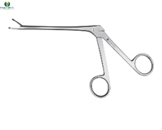
  

## Cholangiogram Forceps

  

    - Cholangiogram Forceps are also known as Olsen clamps. They fall into the category of grasping and holding instruments. They are very long. They have serrations on their jaws that run horizontally. They are specially designed to grasp the catheter and adjust its direction.
  

  

    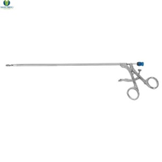
  

## Debakey Forceps

  

    - Debakey Forceps fall into the category of grasping and holding instruments. Their jaws are elongated and perforated with a blunt tip. They have fine serrations that run along the length of one of the jaws. They are used for holding tissues without causing damage. They are mainly used to handle atraumatic tissues.
  

  

    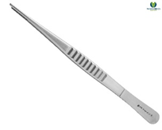
  

## Allis Forceps

  

    - Allis Forceps are those **[surgical forceps](https://www.dynamicmedicalsolution.com/products/forceps)** that fall into the category of grasping and holding instruments. Their jaws are straight, with very fine teeth at the tip. They lift and retract dense tissues.
  

  

    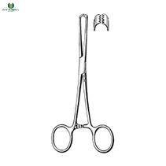
  

## Babcock Forceps

  

    - Babcock Forceps fall into the category of grasping and holding instruments. Their ends are rounded with flattened tips. They are available in 5- and 10-mm sizes. They may be disposable or non-disposable. They are specially designed for holding delicate structures such as the ovaries, ureters, fallopian tubes, and appendices.
  

  

    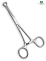
  

## Maryland Bipolar Forceps

  

    - Maryland Bipolar Forceps are also known as bipolar forceps or Maryland forceps. They fall into the category of accessory instruments. It is a bipolar device. The jaws are curved, and the base is perforated. They are used for holding and condensing tissues.
  

  

    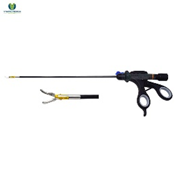
  

## Dissecting Forceps

  

    - Dissecting Forceps are also known as PK forceps. They fall into the category of accessory instruments. Their outer jaws are curved and tapering, while the inner jaws have serrations that run horizontally. They are used for cutting and condensing tissues. They are unique because they are equipped with radiofrequency energy to move or shut tissues. The temperature is kept very low because this reduces tissue blackening and adhesion.
  

  

    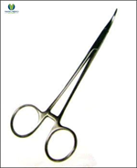
  

## Resano Forceps

  

    - Resano Forceps are also known as shark Forceps. They fall into the category of grasping and holding instruments. Their outer jaws are smooth and straight. The serrations are triangular and lock when closed. They provide firm handling of atraumatic tissues.
  

  

    
  

## ProGrasp™ Forceps

  

    - ProGrasp Forceps are also known as delicate graspers and fenestrated forceps. They fall into the category of grasping and holding instruments. They are smooth and flat. Their outer jaws are wide and have serrations that run horizontally along the length of the inner jaws. They are used for holding and retracting sensitive tissues.
  

  

    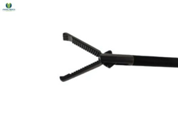
  

## Kleppinger Bipolar Forceps

  

    - Kleppinger Bipolar Forceps fall into the category of accessory pigments. They are used for the congelation of tissues during laparoscopy. One end is attached to a bipolar cord. When the targeted tissues are grasped, bipolar energy is activated, which helps in stepping on the foot pedal. It delivers current from one tip to the opposite tip. A dispersive pad is unnecessary because the electric current doesn’t pass through the patient’s body.
  

  

    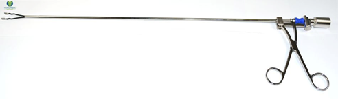
  

## Plate Forceps

  

    - Plate forceps are also known as plate holders, plate-holding forceps, or plate clamps. They fall into the category of grasping and holding. They are different from one another in two ways: one, the type of bone being fixed, and second, the type of plating system being used. The foot and the plate are designed to fit into one another for a strong grip. The foot can swing to settle the forceps onto the plate more precisely. They are used in orthopedic surgery to hold plates in place during screw placement.
  

  

    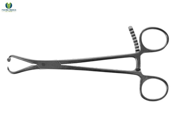
  

## Conclusion

**[Forceps surgical instruments](https://www.dynamicmedicalsolution.com/categories/general-instrumentation)** are vital instruments in the field of surgery. They facilitate the process of surgical operations by grasping and retracting body tissues with great precision and control. They come in a variety of designs specified for each body organ. Nowadays, they are equipped with electrical, laser, and radiofrequency technology, which makes them more reliable tools.
Please visit our website Dynamic Medical Solutions for more information.
